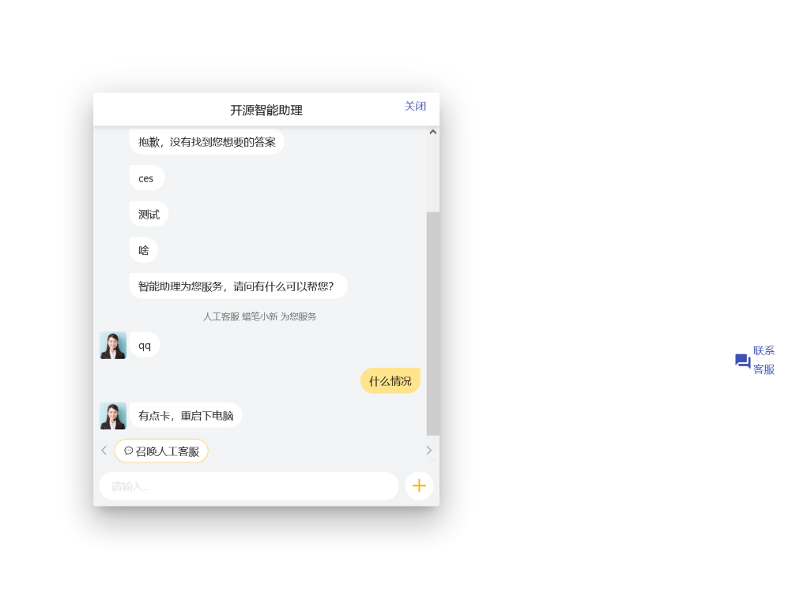
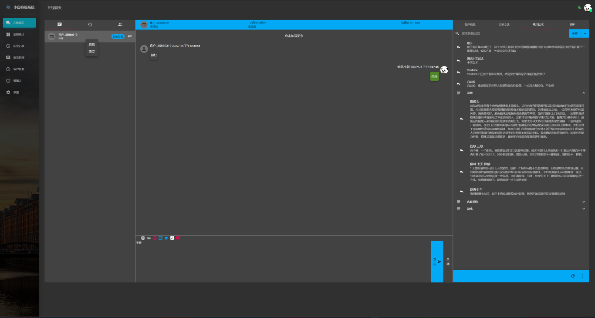
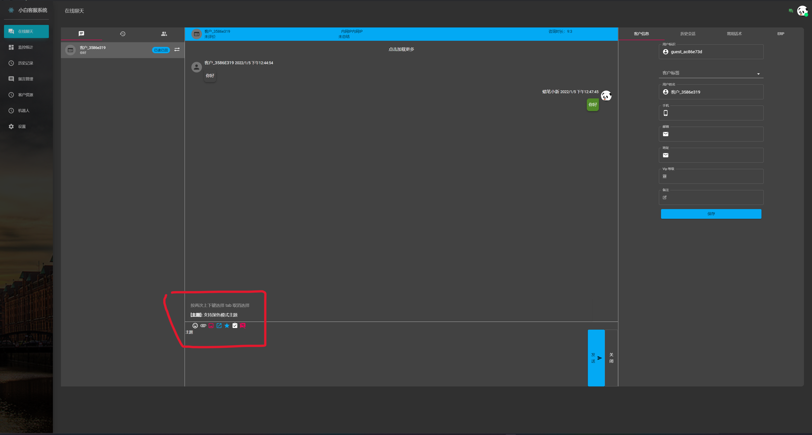

# 小白客服系统

**小白客服现已推出在线版本，访问 [https://xbcs.top/](https://xbcs.top/) 了解详情** (当前开源为早期版本，整体架构与在线版一样)

基于 Spring Cloud 的高并发，高可用，全异步开源微服务客服系统

全自研系统，包括后台服务端和桌面客户端。后台使用 Kotlin + Spring Cloud 开发（本项目也可作为一个 Kotlin 微服务后端的示例项目）

其他项目 :

| 项目名称     | 项目地址                             | 详细说明                             |
| :---------: | :--------------------------------- | :--------------------------------- |
| 客服系统桌面客户端 | [contact-center-client](https://github.com/nedphae/contact-center-client) | 基于 Electron + React 开发的桌面客户端，UI 使用 material-ui |
| 客服系统用户端 | [customer-web-client](https://github.com/nedphae/customer-web-client) | 客服系统用户端，基于 [ChatUI Pro](https://chatui.io/sdk/getting-started) 开发 |

### 客服系统试用账户

| 机构ID          | 账户名称             | 密码                | 客户访问链接             | 客服端                |
| :------------: | :------------------ | :------------------ | :---------------------- | :------------------------- |
| 1001 | admin | 123456 | https://im.xbcs.top/chat/?sc=AGACSCCx | [Windows 客户端](https://xbcs.top/download/) / [Web版本](https://im.xbcs.top/workbench)|

### 系统特性

- 微服务，高并发架构，轻松应对流量冲击
- 全异步系统，反应式架构，提高单机资源利用（基于 WebFlux，数据库访问使用 [R2DBC](https://r2dbc.io/) ）
- 良好的模块化设计，易于扩展
- 提供多种数据接口 (REST API 接口 + GraphQL)
- 基于 OAuth 2.0 权限认证系统 + JWT 无状态的安全验证
- 支持 OSS 文件存储（默认基于 [MinIO](https://min.io/) ，兼容 Amazon S3 ）
- 机器人客服: 提供基于 Elasticsearch 的问答机器人
- 客服人员忙碌时，客户自动排队
- 客户资源管理 + 全文检索
- 常用话术，快捷输入
- 多接待组设置：轻松分类不同客户群与对应客服
- 黑名单、客户留言

### 截图

- **聊天咨询界面** 
  
- **Web嵌入界面** 
  
- **会话标记置顶** 
  
- **快捷回复** 
  

### 安装

#### 系统环境

- PostgreSQL 10.3.17
- Consul 9.2.7
- Elasticsearch 7.13.2
- Kafka 12.12.0
- Cassandra 7.5.7
- MinIO 6.7.2
- Redis 10.6.4

#### 开发环境

- JDK 11.0.8
- Kotlin 1.4.32

#### 配置

在各个项目 resources/application.yml 中修改相应的数据库、Consul、Kafka（仅 [im-access](im-access/src/main/resources/application.yml)
和 [message-server](message-server/src/main/resources/application.yml) 服务需要）、Redis服务地址

Elasticsearch 地址在项目 config/ReactiveRestClientConfig.kt 中修改

MinIO 配置在 [MinioConfig](im-access/src/main/kotlin/com/qingzhu/imaccess/config/MinioConfig.kt) 中修改

PostgreSQL SQL: [SQL 文件](./Init-Script.sql) 会导入需要的表结构，和部分初始化数据，

#### 运行

SpringBoot 项目，可以在IDE中运行，也可以打包为单独的 jar 包运行

### 项目图示

[客服系统架构心得](doc/架构详解.md)

### 详细介绍

子系统（本项目） :

| 系统名称     | 系统地址                                  | 详细说明                             |
| :---------: | :--------------------------------------- | :--------------------------------- |
| 机器人服务   | [bot](bot)                               | 客服系统QA（base on ElasticSearch）机器人 |
| 调度服务     | [dispatching-center](dispatching-center) | 客服调度服务，根据配置策略分配客服 |
| 网关        | [gateway](gateway)                       | 微服务网关，提供统一的系统入口 |
| 接入服务     | [im-access](im-access)                   | IM WebSocket 接入服务，包括 客户端 http 接入 |
| 消息服务     | [message-server](message-server)         | IM 消息路由，消息存储服务，客服/客户在线状态管理服务（base on hazelcast embedded） |
| 授权服务     | [oauth2-auth-server](oauth2-auth-server) | oauth2 授权服务，签发加密JWT |
| 客服信息     | [staff-admin](staff-admin)               | 客服信息管理服务，包括客服账号，客服分组，客服分流（接待组），配置管理等 |
| graphql 聚合服务 | [GraphQLBFF](GraphQLBFF)             | GraphQL 接口服务，提供后台 http 接口的 GraphQL 聚合封装 |

### 开发计划注解图例

| Mark     | Description      |
| :------: | :--------------- |
| 🏃       | work in progress |
| ✋       | blocked task     |
| ❌       | deprecated       |
| ⚫        | planning         |

### Changelog

[Changelog](CHANGELOG.md)

### 联系方式

**email: [nedphae@gmail.com](mailto:nedphae@gmail.com)**

**QQ 群:** 

