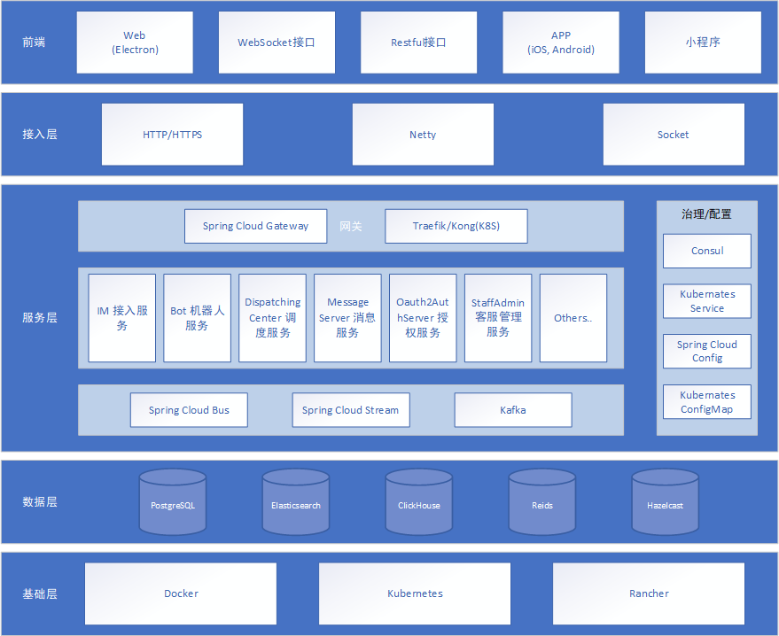

# 客服系统

一个基于 Spring Cloud 的微服务客服系统

### 详细介绍

子系统：

| 系统名称     | 项目名称                                  |
| :---------: | :--------------------------------------- |
| 机器人服务   | [bot](bot)                               |
| 调度服务     | [dispatching-center](dispatching-center) |
| 网关        | [gateway](gateway)                       |
| 接入服务     | [im-access](im-access)                   |
| 消息服务     | [message-server](message-server)         |
| 鉴权服务     | [oauth2-auth-server](oauth2-auth-server) |
| 客服信息     | [staff-admin](staff-admin)               |

### 项目图示

[客服系统架构心得](doc/架构详解.md)

### 开发计划注解图例

| Mark     | Description      |
| :------: | :--------------- |
| 🏃       | work in progress |
| ✋       | blocked task     |
| ❌       | deprecated       |
| ⚫        | planning         |

### 后续开发计划

- [ ] ⚫ Apache Kylin + Saiku / SuperSet + Apache Druid  进行 OLAP 数据分析模块开发

- [ ] ⚫ 数据使用 kafka 导入到 kylin / hbase / hadoop