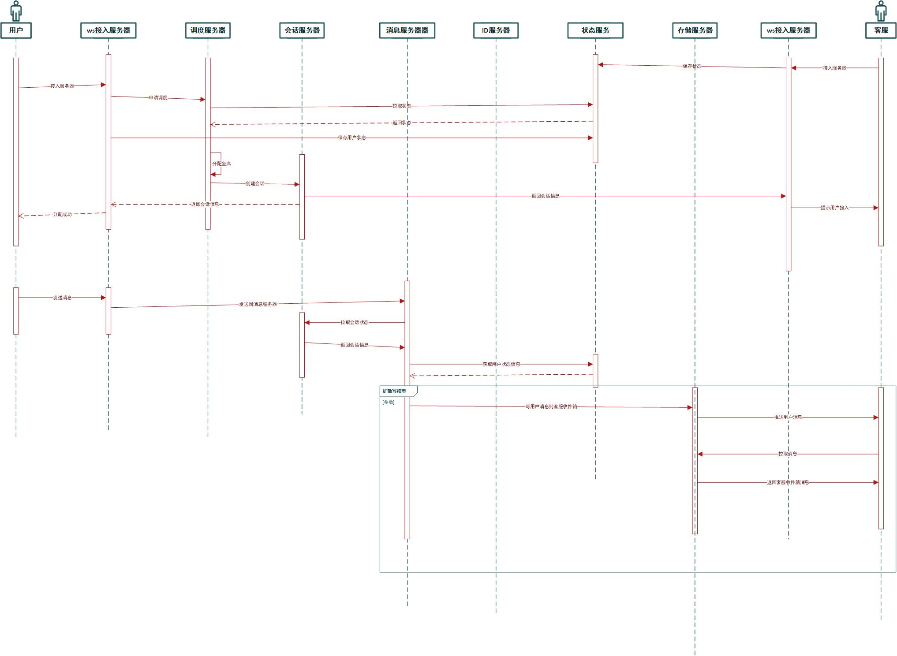
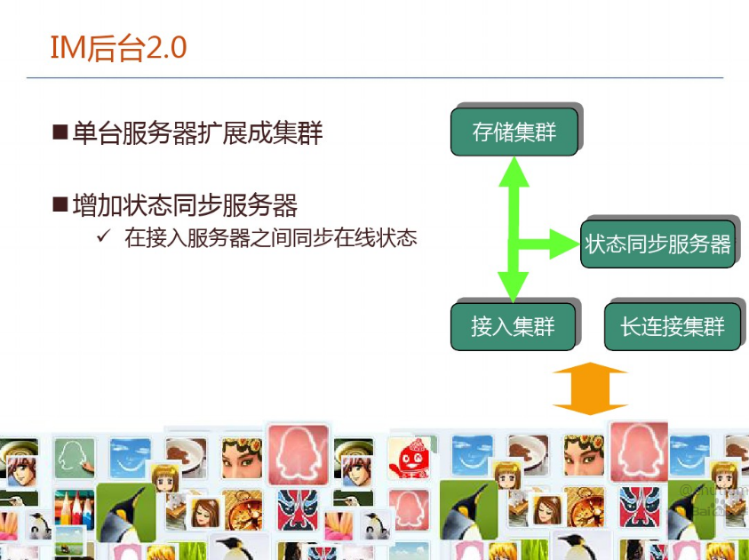
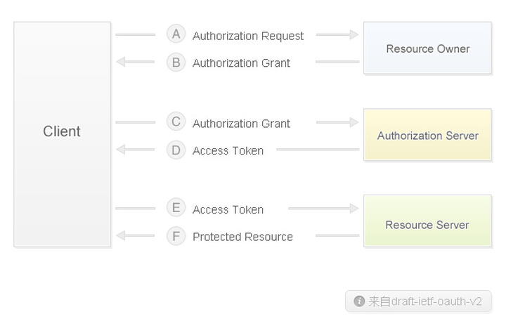

# 客服系统架构心得

### 开始接手

最初2019年下半年入职了一家公司负责客服系统的开发，这个客服系统是根据一个开源的客服系统（优客服）做二次开发，来满足公司客服的一些需求，用以替换现在使用的商业客服系统。

当时刚接手时，发现了这个开源的系统存在一些问题可能导致后期开发会出现各种问题：

1、首先是代码质量，当时查看源码已经发现源码大概经过了3、4人手开发，而且是完全替换人手，导致代码风格和架构风格双双割裂。

2、架构问题：做为客服系统，最重要的聊天系统没有进行合理的设计，没有在应用端做消息的接受确认。所有WebSocket消息没有做Ark，没有做WebSocket应用级的消息标识，只是依托于Socket.IO框架自身的消息机制。

项目整体使用 Freemarker 模板形式进行开发，没有使用 SPA/客户端 模式。这样导致前后端耦合太严重，优化困难，还有服务器资源的极大浪费。（就客服系统来说，实际上的产品大部分也都做成了桌面应用，以本地安装包的形式分发客户端）

而且客服、客户状态数据，聊天数据全部存储在数据库中，每次刷新信息都会从数据库读取，性能十分底下。

3、文档：没有开发文档，只有产品文档

4、系统阉割：开源的代码相较于其本身系统删除了部分模块，但是又留有一部分接口（项目本身结构就很差，估计是要删除干净太费劲），这样显得就更混乱了。

### 提出优化

由于以上系统存在的问题，而且接手时的开发要求是系统能承受大量的并发（公司当时租用的客服系统因为大量的客户咨询导致服务器崩溃了）。所以当时就提出了根据这个开源客服系统，再加上自己公司客服的需求重新开发一个新系统，并且做出了大致的架构图。

架构图与现在的系统结构几乎一致，包括机器人、调度服务器、会话服务器、网关、接入服务器、Id服务器（分布式Id生成器）、消息服务器、状态服务器、存储服务器（对象存储系统）、客服信息服务器、授权服务器（OAuth 2.0 with JWT）

> 原来的流程图

现在的系统架构相较而言做了一些修改，因为实际搭建过程中发现会话服务器和状态服务器之间的信息通信过于频繁，包括消息服务器，也需要查询状态服务器。每次会话的创建和销毁都伴随着状态的修改。而且客服客户端接入新客户时会将客户信息连同会话信息一块接受到，同时客户端也会设计成缓存会话信息，所以会话服务器已经没有单独存在必要。

至于ID服务器，这个因为公司也使用了dubbo开发微服务，我以为公司会有搭建统一的分布式id生成服务，类似于百度Uidgenerator，美团Leaf这种，但是没有。所以后面就仅仅使用了雪花算法(由接入服务器生成)
，主要是实现简单，而且做测试方便，不用再搭建一个id生成服务。现有的系统也是使用SnowFlake雪花算法，当然雪花算法也存在一些问题，这里就不详谈了。

> 现在的系统架构

存储服务器器这个在现在的系统架构里还是会存在的，我考虑使用的是对象存储系统，基于对象的存储系统开源的有不少，包括 Ceph、Swift、MinIO
等。而且市面上的云服务商也都提供了相应的产品，阿里oss、华为、腾讯、七牛等。对象存储系统优势在于RESTful api 访问，接口简单，特别适合图片，语音等小文件存储。

当然这个架构还不完善，主要是应对即时通讯模块的架构。其他的像监控系统，系统配置，报表系统，全文检索（聊天消息查找）都还没有添加。

当时提出的架构并没有被采用（仅仅是抽空新建了几个模块），主要是因为管理层认为这套系统设计过于复杂，达不到要求的一个月上线系统。也是因为没被采用所以我现在才自己开发了这套开源系统，也是不想心血白费。

详细的数据架构设计跟网上这个瓜子的设计差不多：[瓜子IM智能客服系统的数据架构设计](http://www.52im.net/thread-2807-1-1.html), 消息同步都是通过redis zSet，持久化我考虑的是使用
Elasticsearch，瓜子用的 hbase。这俩系统各有各的优势，Elasticsearch 对于大部分公司的数据规模来说已经够用了，而且支持全文索引，聚合等操作，还可以使用kibana做一些简单的统计。

### 客服系统与普通IM系统的差别

虽然客服系统的核心也是IM，但是相较于标准的IM系统还是有不少差别的：

1、联系人，客服系统不需要维护好友关系，而且客户有一定匿名性。

2、权限系统，不同于IM个人拥有的绝对权限（钉钉一类的除外，这一类已经不单单是IM了），客服系统权限比较复杂，可能有超级管理员，组长，普通客服等角色，普通客服的权限会收到很大限制。

3、监控 & 统计：客服系统管理员需要能随时查看客服的聊天情况，还有一些历史记录搜索，实时监控等

4、机器人，这个功能一般客服系统都是必备的，IM一般通过第三方账号实现这个功能，类似 telegram bot，微信的一些公众号

### 架构设计详解

一般现在的系统稍微有点并发的都会进行微服务化开发，现在的微服务架构都有很成熟的方案，无论是纯Java，还是和其他语言组成的异构系统。 尤其是 SpringCloud，已经囊括了微服务开发的方方面面。（当然也有用 Vert.x 实现的微服务）

做一个项目需要考虑的问题不少：人员配置，资源投入，开发周期，项目需求等等，需要根据这些做一个综合的评定，但是架构一般只需要从技术角度考虑即可。有的人可能觉得使用微服务会使项目复杂化，但是考虑到现有的框架成熟度，还有具体的需求（高并发，高可用），进行微服务化设计是必须的。

#### 服务拆分

微服务化设计首先的就是要对系统进行拆分，划分模块，模块设计的追求和软件工程的理念一样，都追求高内聚低耦合。对于客服系统，可以分为，IM系统（包括多渠道接入），监控系统，历史消息查询系统，报表系统（数据统计），CRM，工单，机器人。

客服系统最重要的功能就是聊天咨询了，这个可以参考现有的IM系统的架构，一般情况下IM架构都是如下图（QQ的早期架构）：

> 接入服务器，状态服务器，存储服务器都是分开的，这样做方便扩展，比如QQ就从单台接入服务器改成了集群。

接入服务器独立的好处也有可以方便添加其他接入类型，比如TCP，HTTP，WebSocket，MQTT等，只需要再开发不同的 broker 即可。

状态服务器用来在多个接入服务器之间同步状态，也可以有一定的消息路由功能，负责把聊天消息发送到接收者的接入服务器，有的架构设计的粒度比较小的还会拆分出状态和单独的路由服务器。当然这些也是根据相应的业务需求来设计的，比如你的业务比较复杂，包括不同类型的消息处理，那就可以拆分一个无状态的路由服务器，用来做消息的分发。

上面就写了，在设计的初期我也是把路由服务（消息服务器）单独拆分，但是考虑到RPC调用的延迟，还有增加了业务复杂度（实际业务比较简单，不存在复杂的IM需求）就没有使用单独的路由服务。

其他模块的拆分就比较自然了，机器人服务是可以完全独立的，设计时可以把每一个机器人(一个机器人可以包括多台机器)当成一个客服来看待，这样设计可以降低机器人和系统的耦合。后面无论时升级机器人还是机器人断线了都不会影响人工的正常服务。

调度中心对于客服系统来说单独存在是必要的，客户接入时的坐席分配都是有一定策略的，比如单独的VIP列队，黑名单，自动转人工等功能，包括客服的分配策略，熟客分配，客服优先级，甚至可以通过机器学习模型优化分配策略。有的时候还要根据客服类型进行分配，售前，售后等，或者根据公司的业务，不同的业务设置不同的客服组等等策略。所以调度也算是比较重要的一个模块了。

客服管理模块，这个拆分也是很自然的，这个相当于IM的账号模块，用来保存客服的基础信息，包括一些客服的设置。

权限模块，单独存在是必然的，一般的公司也都会有自己的SSO平台，现在也有不少的云SSO可以使用：包括Okta，Amazon Cognito，阿里 IDaaS。开源的也有KeyCloak

#### 权限系统

权限几乎是任何系统都必不可少的模块，当然也因为必不可少，催生了不少的开源方案。

在设计权限系统时我选择使用了 oauth2.0 with jwt 的方案，至于选择这个方案的原因很简单，就是可以无状态鉴权，对系统并发的影响比较小。

JWT 缺点不少，包括
oauth，但是对于客服系统这种准内网系统而言也基本够用了，后面看到瓜子也是用的jwt：[用JWT技术解决IM系统Socket长连接的身份认证痛点](http://www.52im.net/forum.php?mod=viewthread&tid=2106&highlight=jwt)
jwt的主要缺点就是注销，包括token泄露后安全问题。

对于客服系统来说，jwt提供的功能也基本够用，鉴权系统的搭建完全使用Spring那一套，使用的是AuthorizationServer。但是这一套现在已经被Spring废弃了，有一段时间Spring官方推荐使用KeyCloak。后面因为社区的意见Spring又重新开启了一个AuthorizationServer项目，感兴趣的可以看一下。

权限系统基本情况是：

依托于 Spring OAuth2 进行权限设计，使用 Spring Security GlobalMethodSecurity 根据设计好的角色在开发时就可以进行API权限设计.

同时使用 JWT 作为认证 Token，降低了服务端进行鉴权时的资源消耗.

OAuth2 + JWT 支持跨域传输，因此也可用于整个系统的单点验证，后期也便于和现有系统的 ERP模块打通.

GlobalMethodSecurity 的缺点是需要开发时期就要确定权限

权限模块具体实现

每个业务服务可以定义自己所属的资源模块，通过开启 @EnableResourceServer 并继承实现 ResourceServerConfigurerAdapter 来实现

业务服务通过指定自己的 resourceId 来判断 AuthorizationServer 赋予的权限(resourceIds)是否包含本服务

resource 鉴权后，进入业务API，业务API 通过 @PreAuthorize 注解判断用户角色

resource 可以通过数据库修改，API 权限编码时确定

#### 后续

后面会添加客服系统数据模型设计，包括消息库设计，统计分析模块

#### 项目开源地址

后台服务项目：https://github.com/nedphae/contact-center

客户端项目：https://github.com/nedphae/contact-center-client
